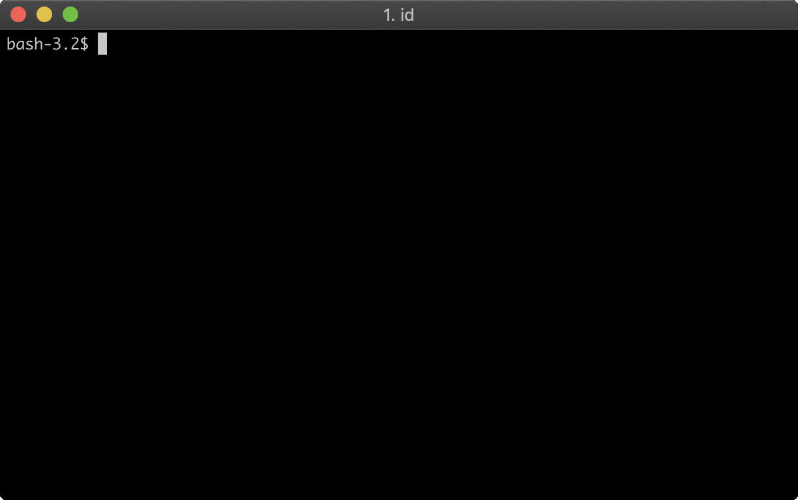

# Kf

[![knative.slack.com][slack-badge]][kf-slack]

`kf` provides a `cf`-like experience on top of Knative.



`kf` aims to be fully compatible with CF applications and lifecycle. It supports
logs, buildpacks, app manifests, routing, service brokers, and injected services.

At the same time, it aims to improve the operational experience by supporting
git-ops, self-healing infrastructure, containers, a service mesh, autoscaling,
scale-to-zero, improved quota management and does it all on Kubernetes using
industry-standard OSS tools including Knative, Istio, and Tekton.

## Getting started

Follow the [install instructions](docs/install.md) to create a GKE cluster, install Kf into it, and deploy an app with the `kf` CLI.

## How to build

**Requirements:**

  - Golang `1.12` ([go mod](https://github.com/golang/go/wiki/Modules#quick-start)
is used and required for dependencies)


**Building:**

```sh
$ ./hack/build.sh
```

**Notes:**

- The `kf` CLI must be built outside of the `$GOPATH` folder unless
you explicitly use `export GO111MODULE=on`.

## Development and releasing

We use [ko](https://github.com/google/ko) for rapid development
and during the release process to build a full set of `kf` images
and installation YAML.

To update your cluster while developing run `ko apply`:

```
KO_DOCKER_REPO=gcr.io/my-repo ko apply -f config
```

This will build any images required by `config/`, upload them to the provided
registry, and apply the resulting configuration to the current cluster.

[slack-badge]: https://img.shields.io/badge/slack-knative/kf-purple.svg
[kf-slack]:    https://knative.slack.com/archives/kf
