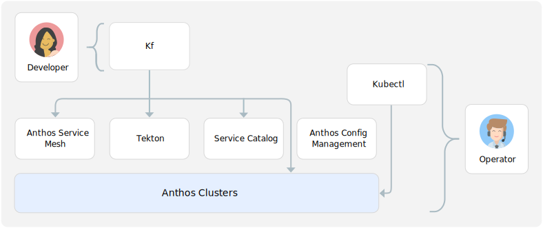

# Migrate Cloud Foundry applications to Kubernetes using Kf
As your teams standardize on Kubernetes, migrating applications from existing platforms like Cloud Foundry is often one of the biggest challenges. Kf, which is now offered as a fully managed service by [Google Cloud Platform](https://cloud.google.com), was designed to help your teams minimize any disruption to developer workflows during the migration to [Google Kubernetes Engine](https://cloud.google.com/kubernetes-engine) and [Anthos](https://cloud.google.com/anthos). 

Kf offers developers the Cloud Foundry experience while empowering operators to adopt declarative Kubernetes practice. It makes migrating Cloud Foundry workloads to Kubernetes straighforward, and most importantly, avoids major changes to developer workflows. You can also eliminate commercial Cloud Foundry licensing costs, and take advantage of the config and policy features of Anthos for governance.

# Additional resources
To get started with Kf checkout these resources:

* Get an overview of KF by reading the [documentation](https://cloud.google.com/migrate/kf/docs)
* Install Kf and deploy a sample applcation by following the [Kf quickstart](https://cloud.google.com/migrate/kf/docs/quickstart)
* Set up [custom dashboards](dashboards) for [Google Cloud Operations](https://cloud.google.com/products/operations)
* Deploy a Spring Cloud Config Server-based [example application](spring-cloud-config-server) to Kf
