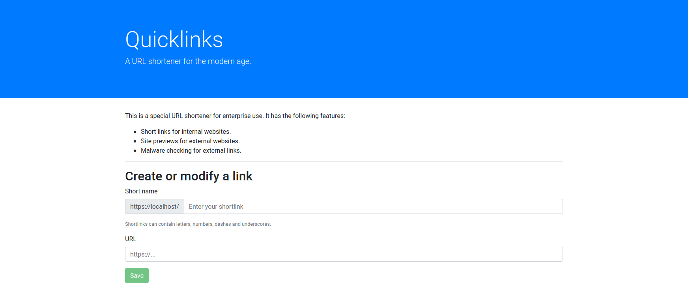

This example Spring application is an enterprise-ready link-shortener.
The URL shortener has the following behavior:

 * URLs internal to your own domain get automatically redirected.
 * URLs on the internet are scanned for vulnerabilities:
   * If the URL is malicious, the redirect is blocked.
   * If the URL is benign, the user is shown a preview of the site and clicking
through opens in a new tab to protect privacy.
   * If the vulnerability scanner is down, a warning is shown.

{}
Following these instructions will result in creation of a CloudSQL database instance
that will incur billing charges on your GCP account.
{}

## Prerequisites

[google-broker]: /docs/operators/service-brokers/google-cloud/
[install-instructions]: /docs/getting-started/install
1. **Kf**: Follow [these instructions][install-instructions] to create a new
   Kubernetes cluster with Kf installed.
1. **Google Service Broker**: Follow [these instructions][google-broker] to
   install.
1. **`git`**: Git is required to clone a repository.

## Stage the app

1. Clone the reference app source and go to the Link Shortener app's dir:

```sh
git clone https://github.com/GoogleCloudPlatform/service-broker-samples.git
cd service-broker-samples/link-shortener
```

1. Open `manifest.yml` in your editor and edit the `env` section:

  1. Set the value of `INTERNAL_DOMAIN_SUFFIX` to `"localhost:8080"`. This will
     allow you to test the application locally after you deploy.

  1. Add a `BP_JAVA_VERSION` key with a value of  `8.*` This will ensure Java 8 is used to build and run the app you deploy.

    The resulting `manifest.yml` should resemble:

   ```sh
	---
	applications:
	- name: link-shortener
	  memory: 1024M
	  instances: 2
	  env:
		GOOGLE_API_KEY: "YOUR_API_KEY_HERE"
		INTERNAL_DOMAIN_SUFFIX: "localhost:8080"
		BP_JAVA_VERSION: 8.*
	```

1. Push the app, adding the `--no-start` flag to ensure it doesn't start:

	```sh
	kf push link-shortener --no-start
	```

## Create and bind a database

1. Create the service:

	```sh
	kf create-service google-cloudsql-mysql mysql-db-g1-small short-links-db
	```

1. Service creation will take several minutes to complete. You can view its
   status by running:

	```sh
	kf service short-links-db
	```

1. Bind it when it's ready:

	```sh
	kf bind-service link-shortener short-links-db -c '{"role":"cloudsql.editor"}'
	```

## [Optional] Configure Safe Browsing API
[safe-browsing]: https://developers.google.com/safe-browsing/v4/get-started
The link shortener app can use Google's [Safe Browsing API][safe-browsing] to
scan target URLs for vulnerabilities and to generate screenshots of the app.
Follow these instructions to enable this functionality in the app.

[enable-safe-browsing]:
https://console.cloud.google.com/marketplace/details/google/safebrowsing.googleapis.com
1. [Enable the Safe Browsing API][enable-safe-browsing]

[create-creds]: https://console.cloud.google.com/apis/credentials
1. Follow [these instructions][create-creds] to create an API token that will
be used to authenticate requests to the Safe Browsing API (note: it is currently
not possible to provision access to this API with the Google Service Broker).

1. Edit `manifest.yml` and set `env.GOOGLE_API_KEY` to the value of the API key
   you retrieved in the previous step.

## Deploy and test the app

1. Once the application is bound, you can start it:

	```sh
	kf start link-shortener
	```

1. Proxy to the app:

	```sh
	kf proxy link-shortener
	```

1. Navigate to http://localhost:8080 in your browser to view and use the app:

## Screenshots:

**Link shortener landing page**



**External redirect**


## Destroy

1. Unbind and delete the CloudSQL database:

    ```sh
    kf unbind-service link-shortener short-links-db
    kf delete-service short-links-db
    ```

1. Delete the app:

    ```sh
    kf delete link-shortener
    ```
