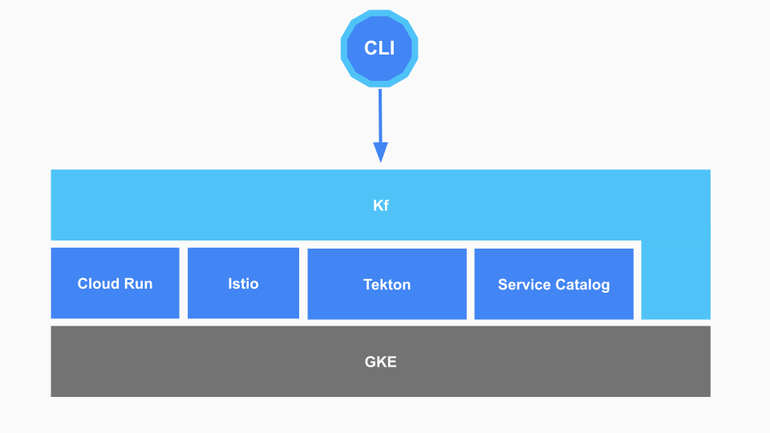

Kf requires Kubernetes and several other OSS projects to run. The default installation provided by `kf install` satisfies a number of these dependencies with Google managed services. For example, Google Kubernetes Engine (GKE) provides Kubernetes and Cloud Run on GKE provides Knative.

## Dependencies
[gke]: https://cloud.google.com/kubernetes-engine/docs/release-notes
[crgke]: https://cloud.google.com/run/docs/gke/release-notes
[istio]: https://cloud.google.com/istio/docs/istio-on-gke/versions
[build]: https://github.com/knative/build/releases/download/v0.6.0/build.yaml
[tekton]: https://github.com/tektoncd/pipeline
[svcat]: https://github.com/kubernetes-sigs/service-catalog/releases

| Name                      | Version       | Maturity   | Notes                                                         |
| ---                       | ---           | ---        | ---                                                           |
| [GKE][gke]                | 1.13.6-gke.13 | GA         |                                                               |
| [Cloud Run on GKE][crgke] (Knative Serving) | 0.6.1-gke.1   | Beta       |                                                               |
| [Istio][istio]            | 1.1.3-gke.0   | Beta       |                                                               |
| [Knative Build][build]    | 0.6.0         | Deprecated | Will be replaced with [Tekton Pipelines] in a future release. |
| [Service Catalog][svcat]  | 0.1.43        | Alpha      |                                                               |



## Kf Components
[crds]: https://kubernetes.io/docs/concepts/extend-kubernetes/api-extension/custom-resources/
[controllers]: https://kubernetes.io/docs/concepts/workloads/controllers/
Kf installs several of its own Kubernetes [custom resources][crds] and [controllers][controllers]. The CRDs effectively serve as the Kf API and are used by the `kf` CLI to
interact with the system. The controllers use Kf's CRDs to orchestrate the other components in the system including scheduling a build with Knative Build, deploying an image with Knative Serving, or creating a database instance with Service Catalog.

### Kf CRDs
You can view the CRDs installed and used by Kf with the following command:

```sh
kubectl api-resources --api-group=kf.dev
```

The output of that command is:

```sh
NAME          SHORTNAMES   APIGROUP   NAMESPACED   KIND
apps                       kf.dev     true         App
routeclaims                kf.dev     true         RouteClaim
routes                     kf.dev     true         Route
sources                    kf.dev     true         Source
spaces                     kf.dev     false        Space
```


| Name        | API Group | Description                                                                                                                           | List all (`kf`) | List all (`kubectl`)                   |
| ---         | ---       | ---                                                                                                                                   | ---             | ---                                    |
| apps        | kf.dev    | A 12-factor application deployed to Knative. It encompasses source code, configuration, and the current state of the application.     | `kf app`        | `kubectl get apps -n namespace`        |
| routes      | kf.dev    | A high level structure that encompasses an Istio VirtualService and configuration applied to it.                                      | `kf routes`     | `kubectl get routes -n namespace`      |
| routeclaims | kf.dev    | Similar to Route, however it is not associated with an App. It is created (by the Route Controller) along with its associated Routes. | n/a             | `kubectl get routeclaims -n namespace` |
| sources     | kf.dev    | The source code and build configuration for an App                                                                                    | `kf builds`     | `kubectl get sources -n namespace`     |
| spaces      | kf.dev    | A high level structure that encompasses a namespace, permissions on it and configuration applied to it.                               | `kf spaces`     | `kubectl get spaces`                   |

## Service Accounts
[service-account]: https://kubernetes.io/docs/reference/access-authn-authz/authentication/
[iam]: https://cloud.google.com/iam/docs/service-accounts
Kf requires the Kubernetes cluster it is running in to have a [service account][service-account]. The service account is used by Knative Build to authenticate to the container registry to which it pushes images. If you install Kf with `kf install gke` it will create a [Google Cloud IAM Service Account][iam] with the `roles/storage.admin` permission.
