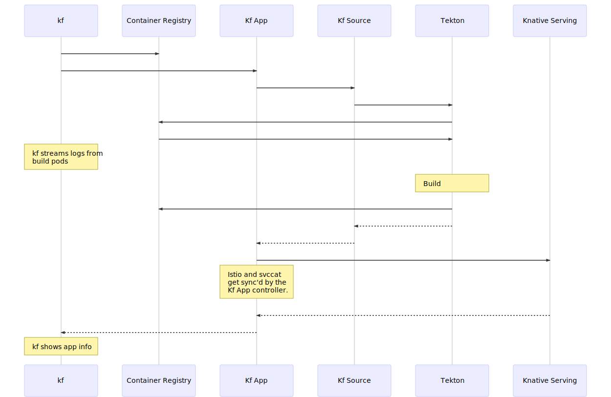

# App::Push

The `cf push` command is actually a complex piece of machinery that works with
multiple pieces of the Cloud Controller to publish an application. `kf push`
similarly works with a variety of Kubernetes components to turn an app's sources
into a container then serves that container.

## Caveats

* `kf` does not have a blobstore like `cf`, instead it uses the same container
registry that will eventually host the containers to store source code. Source
code is stored in self-extracting images using the `kontext` library.
* `kf` uses CNCF buildpacks rather than CF buildpacks.
